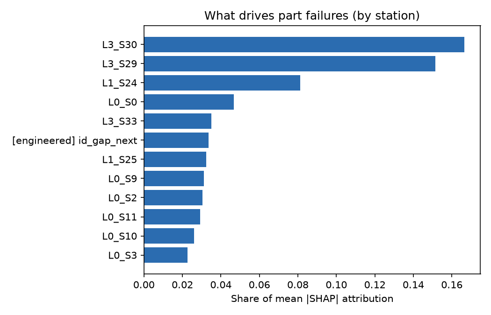

# Machine Sound Guardian

**Acoustic predictive maintenance with physics-based diagnostics and a grounded LLM ticket agent.**

Listen to industrial machines (fans, pumps, valves, slide rails), flag developing faults using only
recordings of *healthy* operation, explain which component is the likely cause, and write a maintenance
ticket a technician can act on. A second module predicts part failures on a real Bosch production line
and traces them back to the stations responsible.

```
 wav ──► log-mel (numpy) ──► anomaly detector ──► score vs. threshold ─┐
   │                        kNN / PCA / GMM / AE / ID-CNN              │
   └──► envelope analysis ──► shaft speed, impact frequency ──► physics guard rail
                                     │                                  │
                                     ▼                                  ▼
                           evidence JSON  ──► LLM (Ollama / Claude) ──► grounding check ──► ticket
                                                    └──── fails? ──► deterministic template

 Bosch line data ──► process-flow features ──► LightGBM (5-fold CV) ──► MCC / PR-AUC
                                                     └──► TreeSHAP ──► failure drivers by station
```

## What is in here

| Module | What it does |
|---|---|
| `audio_features.py` | Log-mel spectrograms in pure numpy/scipy, so the same code runs on a laptop and a Raspberry Pi |
| `detectors.py` | Unsupervised detectors trained on normal sound only: PCA reconstruction, GMM, and a **domain-normalised kNN** that adapts to new operating conditions from a handful of clips |
| `torch_models.py` | GPU models: the DCASE dense autoencoder baseline, and a **self-supervised ID-classifier CNN** (learns to recognise machine section, domain and operating attributes; scores anomalies by embedding nearest-neighbour distance) with mixup and class balancing |
| `evaluate_audio.py` | DCASE protocol: per-section AUC (source / target domain), pAUC (FPR ≤ 0.1, standardised exactly as the official evaluator), official harmonic-mean score |
| `explain.py` | **Envelope analysis** from vibration engineering: shaft speed vs. the repetition frequency of high-frequency impacts separates imbalance (1×), bearing defects (non-integer multiple), and blade-pass / gear-mesh (integer multiple) |
| `ticket_agent.py` | Hybrid alerting (ML score + physics guard rail), LLM ticket writer (Ollama locally or Claude API), **grounding check** that rejects any frequency the LLM mentions that isn't in the evidence |
| `tabular_bosch.py` | Bosch Production Line Performance (1.18 M parts, 968 features, ~0.58 % failures): process-route, cycle-time and production-order features, LightGBM, MCC-optimal threshold, native TreeSHAP aggregated per station |
| `edge_export.py` | PyTorch → ONNX → INT8; benchmark the full wav → prediction path on any CPU |
| `app/dashboard.py` | Streamlit: inspect a clip, replay a fleet over time, view the Bosch line analysis |
| `resume.py` | Prints resume bullets using **your** real results (refuses synthetic numbers) |

## Quick start (Windows, ~5 minutes)

```powershell
python -m venv .venv; .venv\Scripts\activate
pip install -r requirements.txt
pip install torch --index-url https://download.pytorch.org/whl/cu124   # CUDA build for an RTX GPU
python scripts\smoke_test.py          # whole pipeline on synthetic data
python -m pytest tests -q
streamlit run app\dashboard.py
```

The smoke test generates synthetic machine sounds with injected bearing, imbalance and whine faults.
It proves the code runs; **its numbers are not results**.

## Real data

1. **DCASE Task 2** (machine-condition monitoring). Download the *development* dataset for the 2023 task
   (7 machine types, source and target domains) from the DCASE challenge site (dcase.community → Challenge 2023 →
   Task 2; files are on Zenodo). The 2020 dev set and raw MIMII also work.
   Unzip so the layout is `data\dcase\<machine>\train\*.wav` and `data\dcase\<machine>\test\*.wav`
   (for MIMII: `data\mimii\<machine>\id_00\normal\*.wav` and pass `--layout mimii`).
2. **Bosch**: `pip install kaggle`, accept the competition rules on Kaggle, then
   `kaggle competitions download -c bosch-production-line-performance -p data\bosch` and unzip
   `train_numeric.csv` and `train_date.csv`.
3. Run everything: `.\run_all.ps1` (or the individual commands inside it).

Approximate cost on a 32 GB laptop with an RTX 4060: audio sklearn models minutes; AE + ID-CNN roughly
20–60 min per machine type; Bosch full data 30–60 min (use `--nrows 500000` for a quick pass).

## Results

Fill these from `results\audio_summary.json`, `results\bosch_summary.json`, `results\edge_benchmark.json`,
or just run `python -m machine_guardian.resume`.

**DCASE 2023 Task 2, development set, fan + valve** (1,000 normal training clips per machine: 990 source,
10 target; 200 labelled test clips each). Mean over the two machines; pAUC uses FPR ≤ 0.1 with the official
evaluator's standardisation (random = 50 %); official score = harmonic mean of all AUCs and pAUCs.

| Detector | AUC source | AUC target | pAUC | Official score |
|---|---|---|---|---|
| *Official DCASE 2023 baseline (AE, MSE), published numbers* | *67.8 %* | *43.4 %* | *55.1 %* | *0.525* |
| **PCA reconstruction (ours)** | **68.3 %** | **47.9 %** | 54.1 % | **0.540** |
| ID-classifier CNN + embedding kNN (ours) | 59.0 % | 49.7 % | 50.8 % | 0.517 |
| Dense autoencoder (ours, baseline architecture) | 64.1 % | 41.5 % | 54.1 % | 0.502 |
| kNN, domain-normalised (ours) | 40.9 % | 49.3 % | 50.2 % | 0.448 |
| kNN, pooled | 42.3 % | 44.3 % | 49.6 % | 0.430 |
| GMM | 55.9 % | 32.3 % | 49.8 % | 0.398 |

Per machine, the strongest results against the published baseline:

| Machine / metric | Baseline | Ours |
|---|---|---|
| Fan, AUC source | 80.2 % | **85.6 %** (PCA) |
| Fan, AUC target | 36.2 % | **60.6 %** (ID-CNN) / 40.9 % (PCA) |
| Valve, AUC source | 55.4 % | **64.7 %** (ID-CNN) |

**Reading these honestly.** DCASE 2023 is deliberately hard: one section per machine, only 10 target-domain
training clips, and anomalies that are often subtle. Even the official baseline sits near chance on the
target domain. The simple PCA detector edges past the baseline overall; the ID-CNN helps most where
the domain shifts (fan target +24 points) but is not yet consistent across machines. The deep models are
trained without a fixed random seed, so their numbers move by several points between runs (the
autoencoder's fan source AUC ranged 74.6–85.4 % across two runs); averaging several seeds is the obvious
next step before drawing strong conclusions.

**Bosch Production Line Performance** (first 300,000 parts, 968 measurements + 9 engineered features,
0.565 % failure rate, LightGBM, 5-fold stratified CV, out-of-fold predictions):

| Metric | Value |
|---|---|
| MCC (threshold chosen on out-of-fold predictions) | **0.324** |
| PR-AUC | **0.228** (random = 0.0056, about 40× better) |
| ROC-AUC | 0.788 |
| Precision / recall at that threshold | 72 % / 15 % (flags 0.12 % of parts) |
| Top failure drivers (share of mean \|SHAP\|) | L3_S30 (16.7 %), L3_S29 (15.1 %), L1_S24 (8.1 %) |



The operating point favours a short, trustworthy inspection list: 7 in 10 flagged parts really fail, at
the cost of catching a minority of all failures. Moving the threshold trades precision for recall.
The engineered production-order feature `id_gap_next` ranks 6th, showing that *when* a part was made
carries signal beyond its own measurements.

**Edge deployment** (ID-classifier CNN trained on DCASE fan, ONNX Runtime, CPU only, 4 threads, laptop Intel CPU;
time covers the full path from raw audio to prediction, including log-mel extraction):

| Metric | Value |
|---|---|
| Model size, FP32 → INT8 | 1.25 MB → **0.33 MB** |
| Latency per 10 s clip (median / p95) | **71.2 ms** / 79.0 ms |
| Real-time factor | 0.007 (about 140× faster than real time) |

Re-run `python -m machine_guardian.edge_export bench` on a Raspberry Pi to measure true edge latency.

## What was verified, and how

* Full pipeline (synthetic audio → detectors → explanations → tickets; synthetic Bosch-format CSVs →
  loader → LightGBM/fallback → SHAP) runs end to end; unit tests cover the grounding check, LLM failure
  fallback and the pAUC metric.
* On synthetic data with known planted causes: station attribution recovered both planted failure
  stations; envelope analysis named the correct fault type for ~98 % of flagged clips; the physics
  guard rail raised recall from 82.5 % to 98.8 % with no extra false alarms. These checks validate the
  logic, not real-world accuracy: real faults are messier, so report real-data numbers only.
* The PyTorch models and ONNX export are written against the standard APIs but must be run on your
  machine (GPU) to produce results.

## Interview talking points

* **Why unsupervised?** Faults are rare and varied; you can record months of normal operation but never
  every failure. Training on normal data only matches how a plant actually works.
* **Domain shift** is the deployment problem: a new motor speed or a noisier hall looks "anomalous" to a
  naive model. Per-domain normalisation with ~10 target clips is cheap and needs no labels.
* **pAUC** matters more than AUC in a factory: it measures detection while false alarms stay below 10 %,
  and false alarms are what make technicians ignore a system.
* **MCC** instead of accuracy for Bosch: with 0.58 % failures, predicting "pass" for everything is 99.4 %
  accurate and useless.
* **Grounding**: the LLM never sees audio, only measured evidence, and its output is checked against it.
  If the check fails the system falls back to a template, so a ticket can never invent a cause.
* **Hybrid ML + physics**: the learned score catches anything unusual; envelope analysis adds a cause
  and a guard rail for strong, well-understood fault signatures.

## Limitations

* Rule thresholds in `explain.py` were set on synthetic signals; tune them on labelled field data before
  trusting cause labels.
* One microphone channel is used; MIMII's 8 channels could support beamforming / localisation.
* The Bosch features are anonymised, so station attribution says *where* to look, not *what* to fix.
